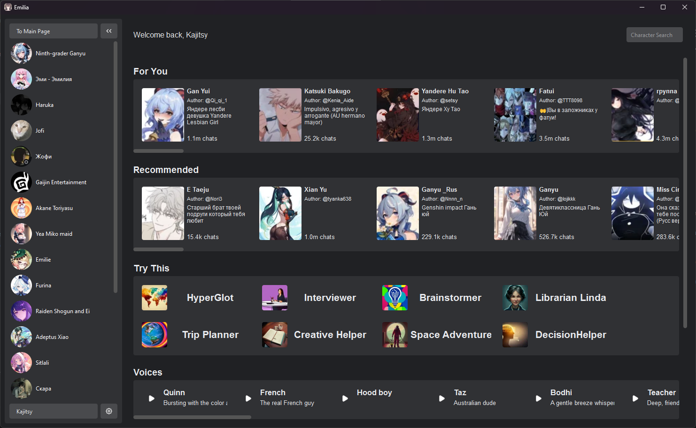
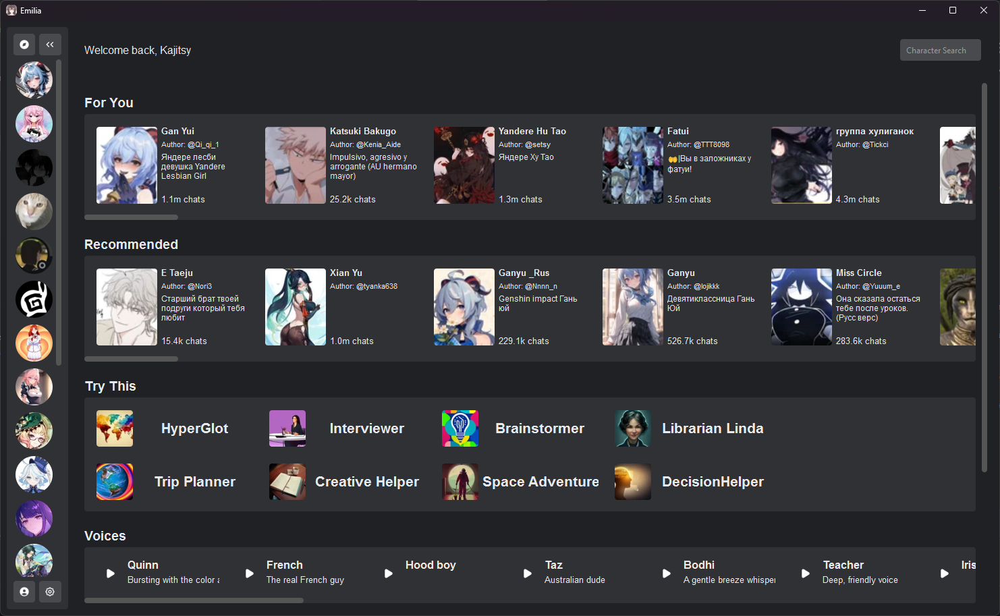
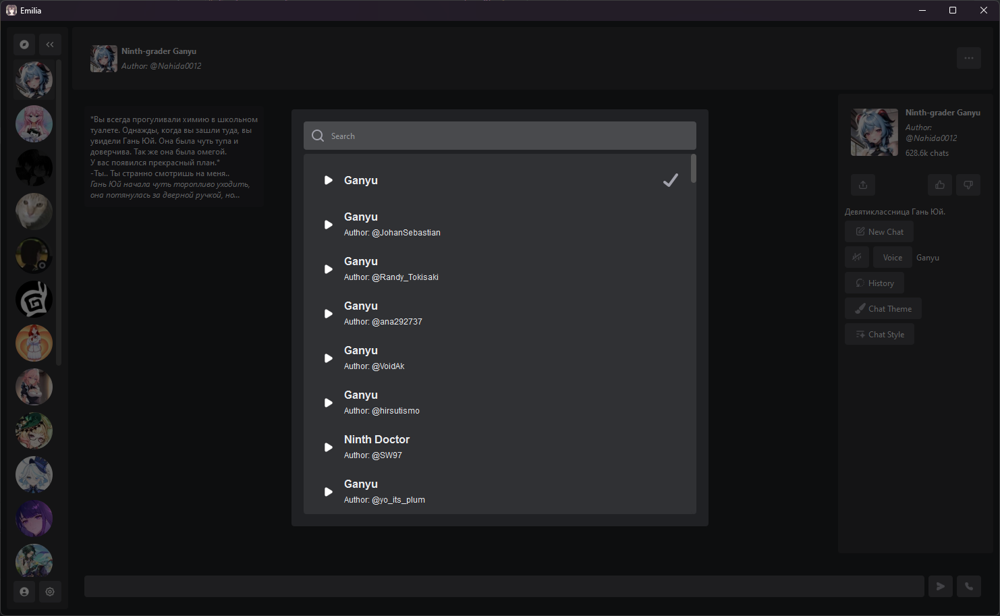
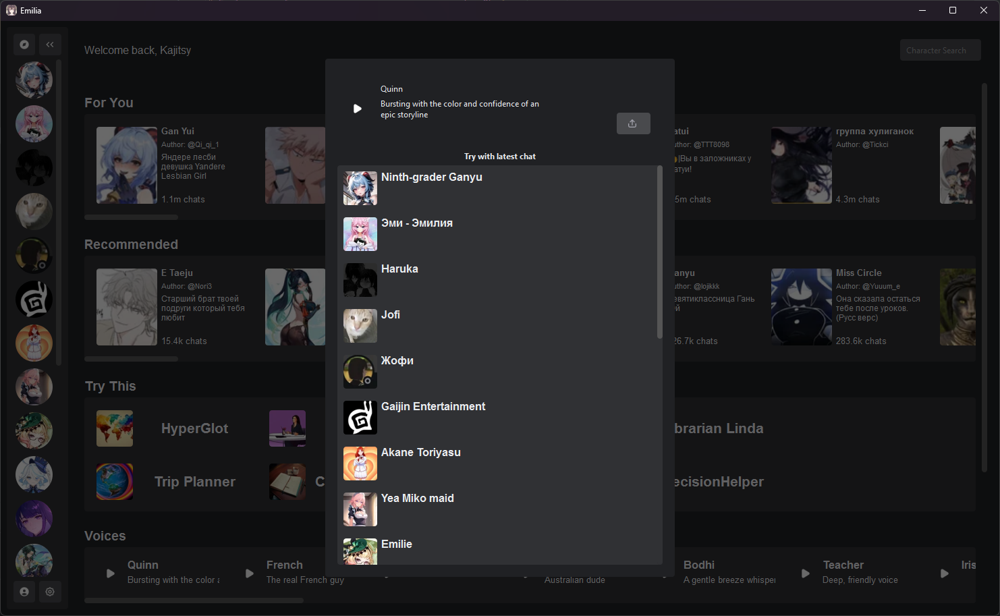
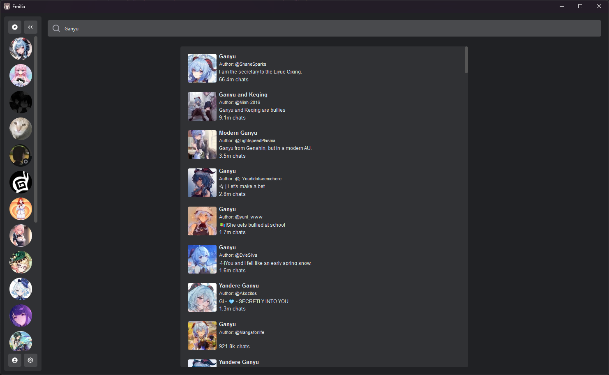
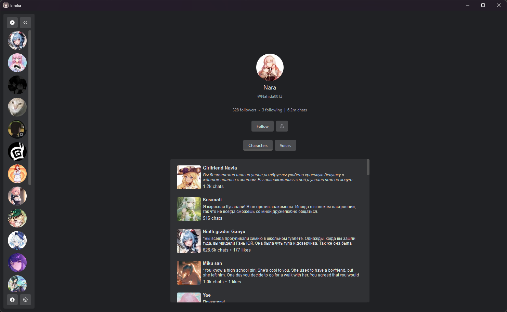
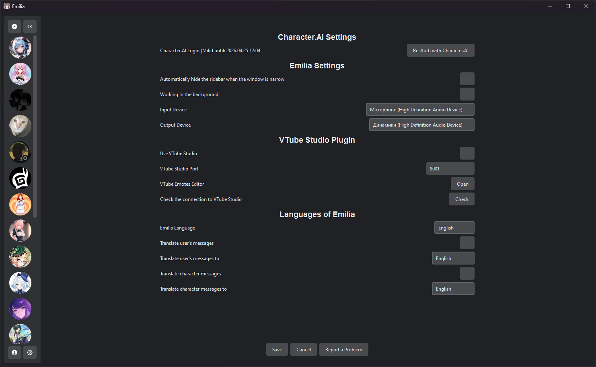

# Emilia - Unofficial (!!!) Desktop Application for [Character.AI](https://character.ai)

## Requirements for Launch...
1. with Installer (Recommended):
- Requires Windows 10 (64-bit) or Windows 11
- 1. Download `EmiliaSetup.exe` from the [latest release page](https://github.com/Kajitsy/Emilia/releases/latest)
- 2. Follow all installation steps
- 3. Find `Emilia` in the Start menu and launch it

2. via WinGet:
- Requires Windows 10 (64-bit) or Windows 11
- 1. Open the command prompt
- 2. Enter/copy `winget install kajitsy.emilia`
- 3. Find `Emilia` in the Start menu and launch it

3. from Source Code:
- Requires Python 3.10-3.13.3
- [Source Code](https://github.com/Kajitsy/Emilia/archive/refs/heads/emilia.zip)
- 1. Install Python
- - Check Python availability in the command line with `python --version`
- - If the output is anything other than `Python 3.x.x` after installation, restart your computer
- 2. Extract `emilia.zip` to a convenient location
- 3. Run `install.bat` **without** administrator privileges and wait for the installation to complete
- 4. Launch the program using `start.bat`, also **without** administrator privileges

## A Few Screenshots of the Application

  <h3>Main Page</h3> 
  
  
  <h3>Everything with Voice</h3> 
  
  
  <h3>And More</h3> 
  
  
  

