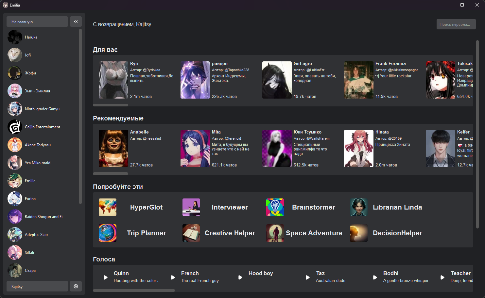
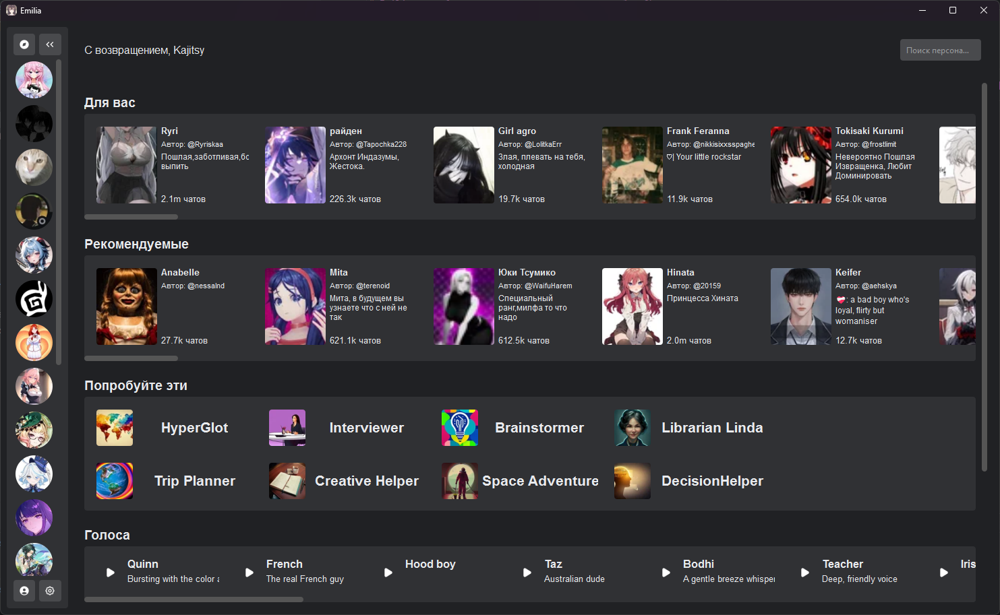
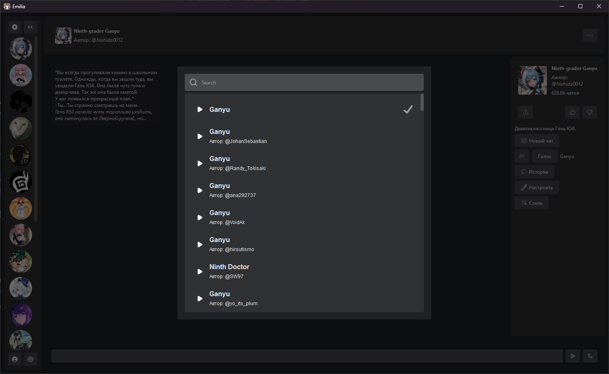
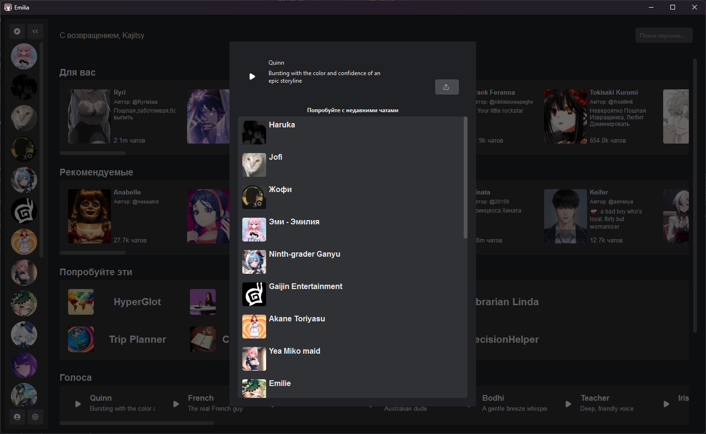
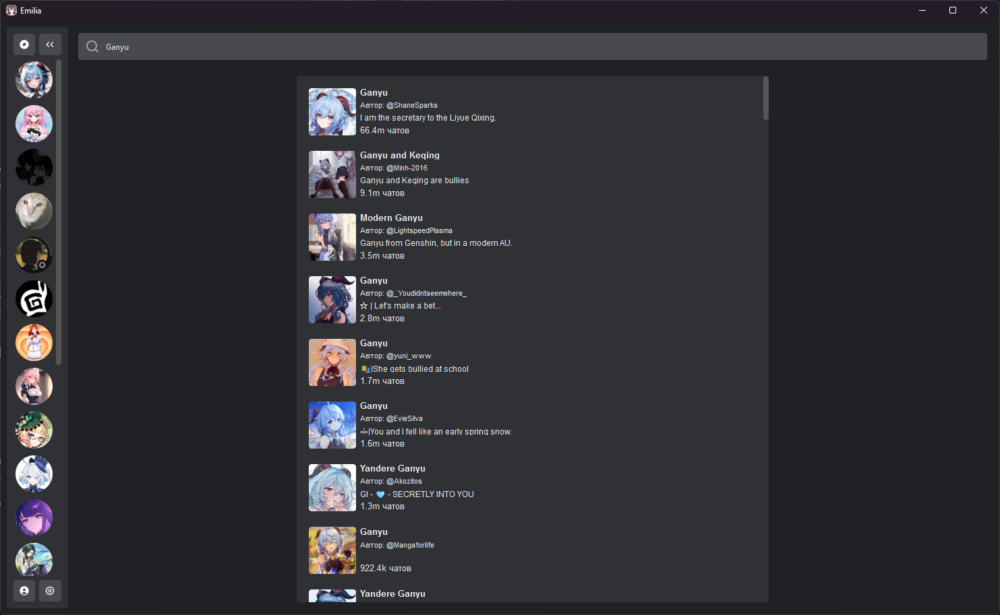
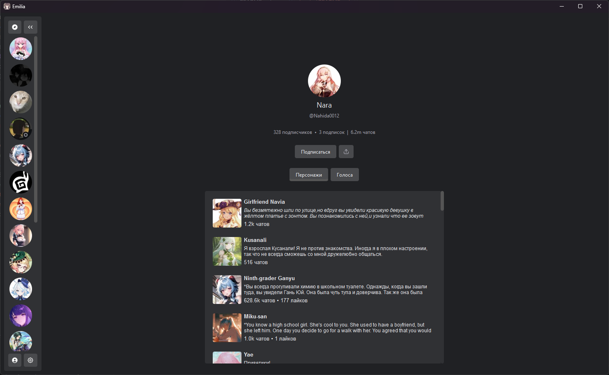
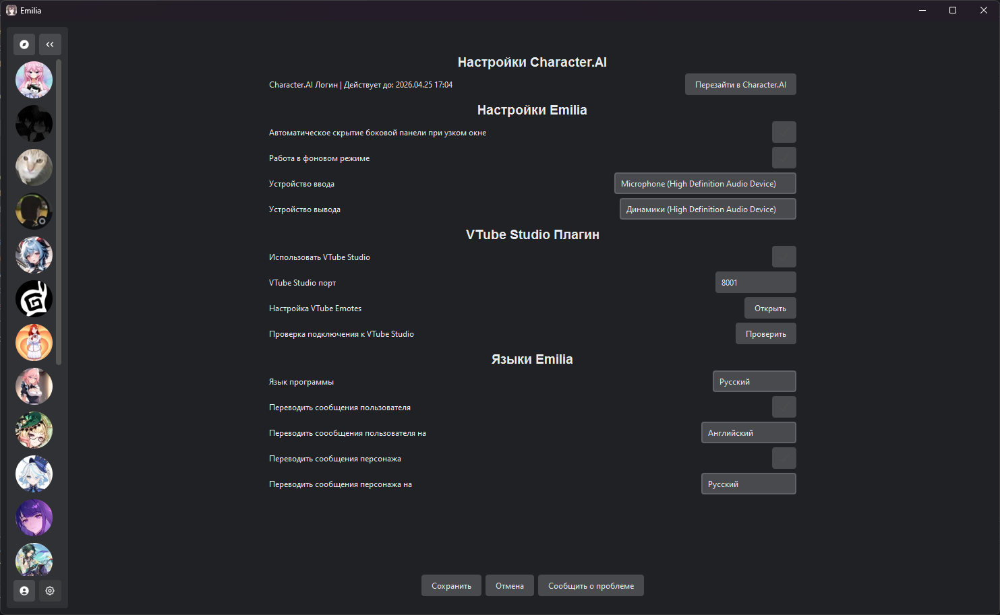

# Emilia - неофициальное (!!!) настольное приложение для [Character.AI](https://character.ai)

## Что нужно для запуска...
1. с установщиком (рекомендуется):
- Требуется Windows 10 (64-бит) или Windows 11
- 1. Скачайте `EmiliaSetup.exe` со [страницы последнего релиза](https://github.com/Kajitsy/Emilia/releases/latest)
- 2. Пройдите все этапы установки
- 3. Смело ищите `Emilia` в меню пуск и запускайте

2. через WinGet:
- Требуется Windows 10 (64-бит) или Windows 11
- 1. Откройте командную строку
- 2. Введите/скопируйте `winget install kajitsy.emilia`
- 3. Смело ищите `Emilia` в меню пуск и запускайте

3. из исходного кода:
- Требуется Python 3.10-3.13.3
- [Сам исходный код](https://github.com/Kajitsy/Emilia/archive/refs/heads/emilia.zip)
- 1. Установите Python
- - Проверьте доступноть Python в командной строке командой `python --version`
- - Если у Вас выводит что-то кроме `Python 3.x.x` после установки Python, перезагрузите компьютер
- 2. Распакуйте `emilia.zip` в удобное вам месте
- 3. Запустите `install.bat` **не** от имени администратора и дождитесь конца установки
- 4. Смело запускайте программу через `start.bat`, также **не** от имени администратора

## Пару скриншотов самой программы

  <h3>Главная страница</h3> 
  
  
  <h3>Всё с голосом</h3> 
  
  
  <h3>Ну и прочее</h3> 
  
  
  

